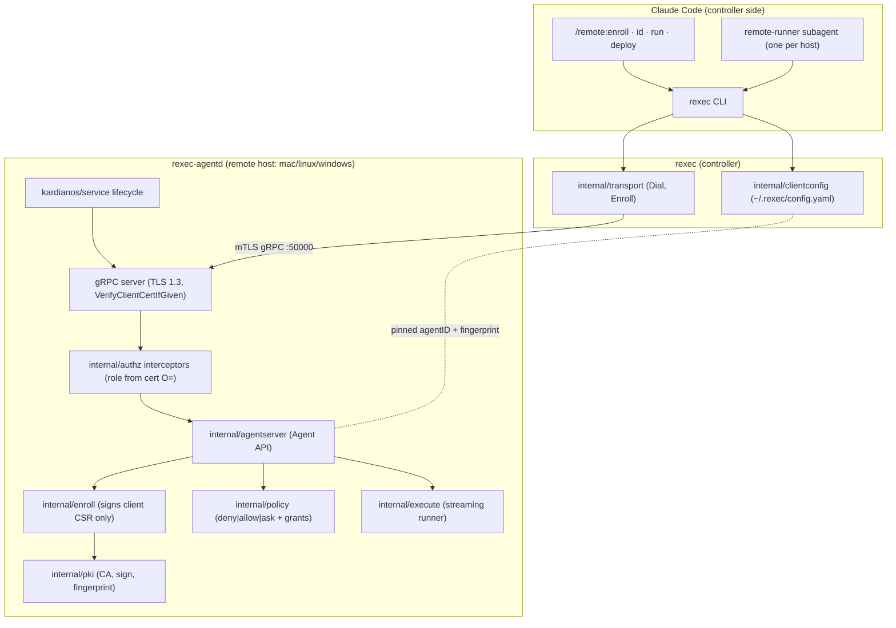
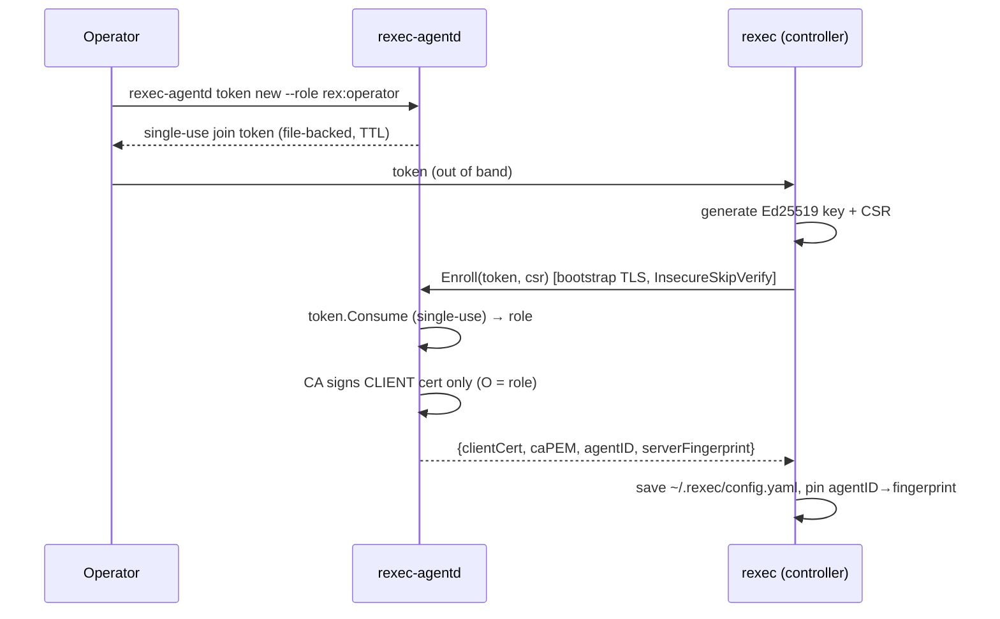
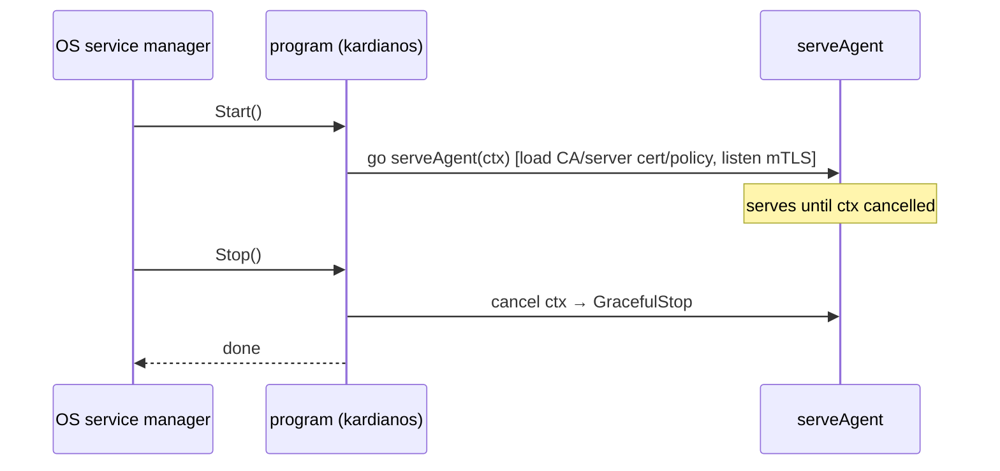

# Architecture
<!-- rev:002 -->

Diagrams reflect the delivered code (v1). See `docs/DESIGN.md` for rationale and
`docs/research/TALOS-SECURE-COMMS.md` for the security derivation.

## System overview



## Enrollment (token-bootstrapped, trustd pattern)



## Destructive deploy — the approval gate

```mermaid
sequenceDiagram
  participant C as rexec exec deploy
  participant I as authz interceptor
  participant D as agentserver.Deploy
  participant P as policy
  participant H as Human (AskUserQuestion)

  C->>I: Deploy(cmd)  [mTLS, client cert O=rex:admin]
  I->>I: role ≥ rex:admin? 
  alt not admin
    I-->>C: PermissionDenied (need rex:admin)
  else admin
    I->>D: forward
    D->>P: Evaluate(cmd)
    alt policy deny
      D-->>C: PermissionDenied (policy)
    else policy allow
      D->>C: stream stdout/stderr, exit_code
    else policy ask
      D->>D: grants.Issue(cmd) → approval_id
      D-->>C: ExecChunk.needs_approval{operation, approval_id}
      C->>H: AskUserQuestion (Approve/Deny)
      alt Approve
        C->>D: Deploy(cmd, approval_id)
        D->>P: grants.Consume(id, cmd)  [single-use]
        D->>C: stream stdout/stderr, exit_code
      else Deny
        C->>C: declined; approval_id expires unused
      end
    end
  end
```

## Service lifecycle (cross-OS)


